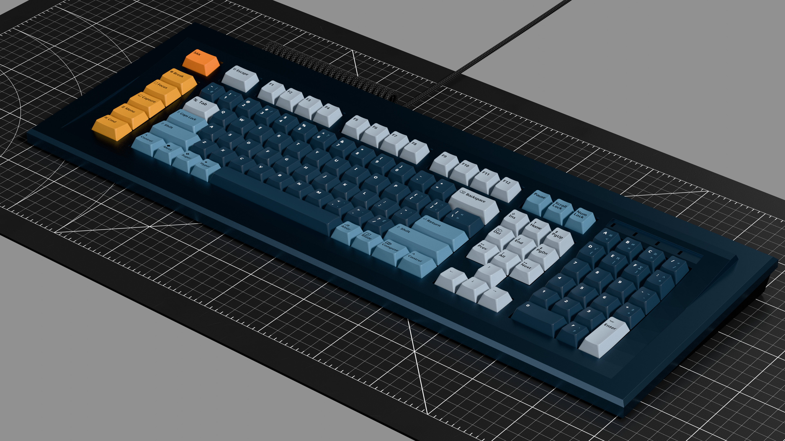

# modern_cadet

A 120% keyboard for nerds paying hommage to the IBM model M and Space Cadet keyboards.
Features all the bucky bits and a hex numpad.  The PCB supports split left shift, split
backspace, split numpad 0, stepped caps lock and two possible additional keys on either
side of the up arrow position (but the default plate does _not_ have openings for
those two keys as-is.

# Things you need to do to construct this keyboard:

## The PCBoard

* to write

## The casing

* to write

## The plate

* to wrote

## Switches

* to write

## Keycaps

* to write

## Firmware

* to write

